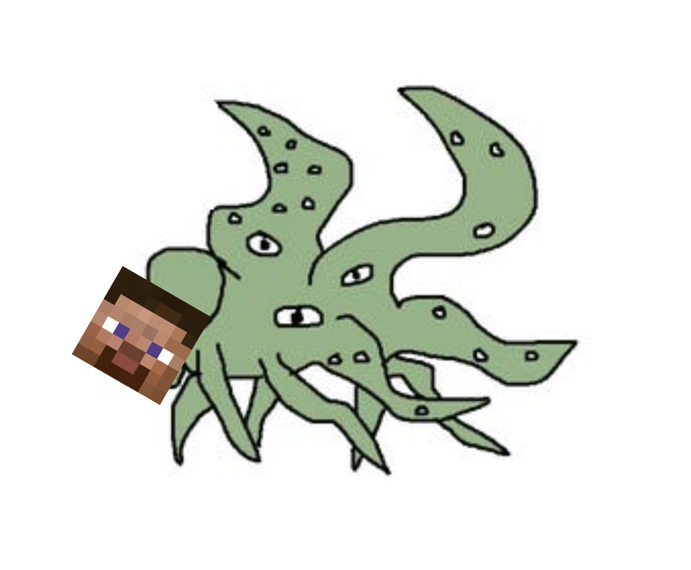

<h1 align="center">
BattleCraftRL
</h1>

<p align="center">
    
</p>

## Requirements

- Python 3.9.16
- Java 8
- [minerl-combat](https://github.com/jhsul/minerl-combat)

## Setup

Install [minerl-combat](https://github.com/jhsul/minerl-combat) using the instructions in the README. Then, clone this repository.

```sh
git clone --recurse-submodules https://github.com/jhsul/battle-craft-rl
cd battle-craft-rl
```

Download the `.model` and `.weight` files from the [VPT readme](https://github.com/jhsul/Video-Pre-Training) and put them in the `models/` and `weights/` directories, respectively.

## Usage

```sh
python src/train.py
```
